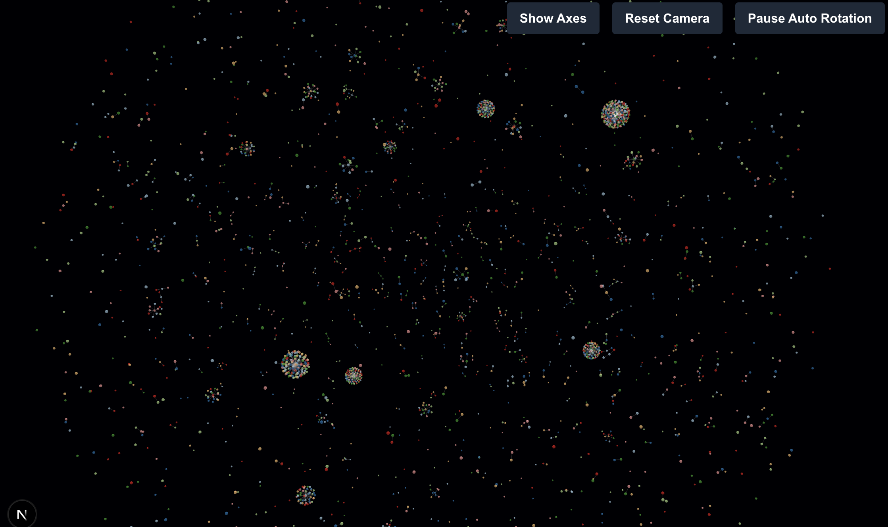

Sure! Here's a well-structured and engaging blog post that explains your GitHub project, focusing on integrating `force-graph-3d` into a **Next.js** project. The tone is informative and approachable — suitable for developers interested in 3D visualization or knowledge graphs.

---

# Integrating `force-graph-3d` into a Next.js Project: A Simple Demo

If you're exploring ways to visualize knowledge graphs or network data in 3D using React and Next.js, you've probably come across the popular library [**`force-graph`**](https://github.com/vasturiano/force-graph) by [@vasturiano](https://github.com/vasturiano). In this post, I’ll walk through how I integrated **`force-graph-3d`** — its WebGL-based 3D force-directed graph implementation — into a **Next.js** app as part of my ongoing **Knowledge Graph + LLM** project.

You can check out the full code here:  
👉 [GitHub - Knowledge_Graph_X_LLM / graph-visualization](https://github.com/gwzz/Knowledge_Graph_X_LLM/tree/main/visulization/graph-visualization)

> ⚠️ Note: This is more of a proof-of-concept/demo than a production-ready solution. There’s still work to be done before this can scale to large or complex graphs, but it’s a solid starting point!

---

## 🎯 Why Use `force-graph-3d`?

`force-graph-3d` offers an interactive and performant way to render large-scale 3D graphs directly in the browser using WebGL. It supports:

- Dynamic force simulation
- Custom node/camera controls
- Real-time updates
- Click/touch interactions

Since I'm working on visualizing knowledge graphs generated via LLMs, having a 3D layout helps users better understand relationships and hierarchies in a visually rich format.

---

## 🛠️ Setting Up the Next.js Environment

I started with a basic `create-next-app` setup:

```bash
npx create-next-app@latest graph-visualization
```

Then installed the required dependencies:

```bash
npm install three force-graph-3d
```

> 💡 `force-graph-3d` relies on **Three.js**, so make sure it's included (either directly or as a peer dependency).

---

## 📐 Creating the Graph Component

I created a new component called `Graph3D.tsx` (or `.jsx`) and imported `ForceGraph3D` from `force-graph-3d`.

Here’s a simplified version of the component:

```tsx
import React, { useEffect, useRef } from 'react';
import ForceGraph3D from 'force-graph-3d';

const Graph3D = () => {
  const containerRef = useRef<HTMLDivElement>(null);

  useEffect(() => {
    if (!containerRef.current) return;

    // Sample graph data
    const graphData = {
      nodes: [{ id: 'Node A' }, { id: 'Node B' }, { id: 'Node C' }],
      links: [
        { source: 'Node A', target: 'Node B' },
        { source: 'Node B', target: 'Node C' },
      ],
    };

    const Graph = ForceGraph3D();
    Graph(containerRef.current)
      .graphData(graphData)
      .nodeLabel('id')
      .onNodeClick(node => {
        console.log('Clicked node:', node);
      });
  }, []);

  return <div ref={containerRef} style={{ width: '100%', height: '80vh' }} />;
};

export default Graph3D;
```

This will render a simple 3D force-directed graph inside a div.

---

## 🧪 Running the App

After creating the component, I imported and rendered it in the main page (`pages/index.tsx`):

```tsx
import React from 'react';
import Graph3D from '../components/Graph3D';

export default function Home() {
  return (
    <div>
      <h1>3D Graph Visualization with Next.js</h1>
      <Graph3D />
    </div>
  );
}
```

Now run the dev server:

```bash
npm run dev
```

Visit `http://localhost:3000`, and you should see an interactive 3D graph spinning in space!

## 📷 Exapmple screenshot:



---

## 🧩 Challenges and Considerations

### 1. **Hydration Issues in Next.js**
Because `force-graph-3d` creates DOM elements outside of React, you might run into hydration mismatches when using SSR. To avoid this, I conditionally render the graph only after mounting on the client side.

### 2. **Performance & Scalability**
Rendering hundreds or thousands of nodes can get heavy quickly. Optimization techniques like throttling force simulation steps or limiting node rendering radius may be necessary.

### 3. **TypeScript Support**
The current example uses JavaScript, but if you're using TypeScript, you'll need to define types for nodes and links manually or use declaration files.

---

## 🌱 What’s Next?

This demo serves as a foundation for building more advanced visualizations. Some ideas for future improvements include:

- Connecting the graph to real LLM-generated knowledge triples
- Adding tooltip support on hover
- Enhancing styling with labels, colors, and icons
- Supporting zoom/pan interaction customization
- Improving accessibility and responsiveness

---

## 🧾 Conclusion

Integrating `force-graph-3d` into a Next.js project isn't too difficult once you navigate around some SSR quirks. With just a few lines of code, you can start rendering beautiful and interactive 3D graphs right in your React application.

As part of my larger **Knowledge Graph + LLM** project, this visualization layer opens up exciting possibilities for understanding and navigating complex semantic relationships.

Let me know if you try this out or have suggestions for improvements!

---

## 🔗 Links

- 📦 GitHub Repo: [https://github.com/gwzz/Knowledge_Graph_X_LLM/tree/main/visulization/graph-visualization](https://github.com/gwzz/Knowledge_Graph_X_LLM/tree/main/visulization/graph-visualization)
- 📚 `force-graph-3d`: [https://github.com/vasturiano/force-graph](https://github.com/vasturiano/force-graph)
- 🚀 Next.js Docs: [https://nextjs.org/docs](https://nextjs.org/docs)

---